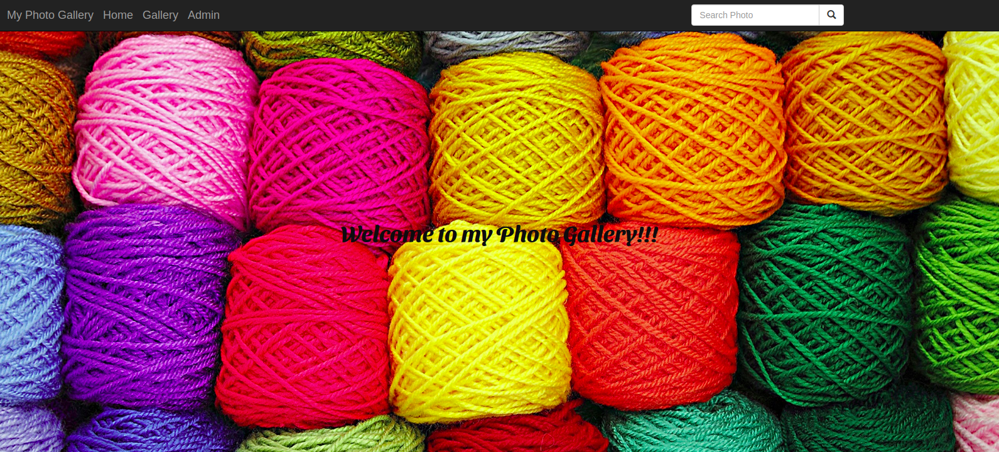

Gallary

[Hassan Juma](https://github.com/HASSAN1A)


## Liv


## User Story

* A user can view photos that interest me.
* Click on a single photo to expand it and also view the details of the photo.
* Search for different categories of photos. (ie. Nature, Food).
* Copy a link to the photo to share with my friends.
* View photos based on the location they were taken.


## Development Installation
To get the code..

1. Cloning the repository:
  ```bash
  https://github.com/HASSAN1A/Gallary.git
  ```
2. Move to the folder and install requirements
  ```bash
  cd Gallary
  pip install -r requirements.txt
  ```
3. Set up your database
    ```bash
    psql
    ```
4. Running the application
  ```bash
  python manage.py runserver
  ```
5. Testing the application
  ```bash
  python manage.py test pics
  ```
Open the application on your browser `127.0.0.1:8000`.


## Technology used

* [Python3.8](https://www.python.org/)
* [Django](https://www.djangoproject.com/)
* [Heroku](https://heroku.com)


## Known Bugs
* There are no known bugs currently but pull requests are allowed incase you spot a bug

## Contact Information 

#  Rental-Hub
### 
####  A Python Flask CRUD web application where users can look for house for rent or buy .



## Description
This is a flask multi-user Rental Hub web application where a user can sign up,log in post  houses for rent and sell,comment on the houses and also get inspired by random business quotes.


#### Get Live link here : [USAGE](https://rentalhub.herokuapp.com/)


## User Stories

- A user I can view various houses on the homepage of the application.
- A user can select a house and see house details from the selected house in the application.
- A user can search for a house on the homepage.
- A user can see the image, description,user and the time a house was created.
- A user can click on an house and read the full house on the source website.

## Behaviour Driven Development (BDD)

| Behaviour                                                                                        |                                                                      Input                                                                       |                                                                                                 Output |
| ------------------------------------------------------------------------------------------------ | :----------------------------------------------------------------------------------------------------------------------------------------------: | -----------------------------------------------------------------------------------------------------: |
| Page loads, user arrives in the landing page, a list of all available house category is displayed. | The user can click on any particular list group item to be directed to a separate page containing house highlights houses by the same user. | On clicking the "post a house" button, the user is redirected to the main login and signup to allow you create an house for sale. |  |

## Features

Here are the summary:

- A landing page showing house categories.
- Clickable houses which direct the user to a page with article highlights from the particular house.


## Requirements

- This program requires python3.+ (and pip) installed, a guide on how to install python on various platforms can be found [here](https://www.python.org/)

##### Contribution

To fix a bug or enhance an existing module, follow these steps:

- Fork the repo
- Create a new branch (`git checkout -b improve-feature`)
- Make the appropriate changes in the files
- Add changes to reflect the changes made
- Commit your changes (`git commit -am 'Improve feature'`)
- Push to the branch (`git push origin improve-feature`)
- Create a Pull Request

### Bug / Feature Request

If you find a bug (the website couldn't handle the query and / or gave undesired results), kindly open an issue [here](https://github.com/HASSAN1A/Rental-Hub/issues/new) by including your search query and the expected result.
If you'd like to request a new function, feel free to do so by opening an issue [here](https://github.com/HASSAN1A/Rental-Hub). Please include sample queries and their corresponding results.

## Built with

1. [Python 3.8.2](https://www.python.org/doc/) : Programming language.
2. [Flask; Python framework used.](https://flask.palletsprojects.com/en/1.1.x/):Framework used.
3. [HTML](https://www.w3schools.com/html/) : Layout.
4. [CSS](https://www.w3schools.com/css/) : Styling.
5. [Bootstrap](https://mdbootstrap.com/) : For responsive websites.
6. [posgreSQL](https://www.postgresql.org/) : Database language.
7. [psycopg2](https://pypi.org/project/psycopg2/) : Database driver.
8. [Javascript](https://www.w3schools.com/js/DEFAULT.asp) : often abbreviated as JS, is a programming language that conforms to the ECMAScript specification.[7] JavaScript is high-level, often just-in-time compiled, and multi-paradigm. It has curly-bracket syntax, dynamic typing, prototype-based object-orientation, and first-class functions.
9. [Google Font API](https://dillinger.io/fonts.google.com) : For prettier fonts Making the web more beautiful, fast, and open through great typography..
10. [Quotes Api](http://quotes.stormconsultancy.co.uk/random.json) : For requesting
11. [Font Awesome](fontawesome.com) : The world's most popular and easiest to use icon set just got an upgrade. More icons. More styles.
12. [jQuery 3](https://jquery.com/) : For special effects.
13. [Figma](https://www.figma.com/file/iTndFXbWHuGkZak60bXr2h/Rental-Hub?node-id=0%3A1) - Blueprint for designing the web app.

## TEAM

1. [Hassan Juma ](https://github.com/HASSAN1A)
2. [Lekam Charity ](https://github.com/LekamCharity)
3. [Kennedy Kiptoo ](https://github.com/kiptoo-097)
4. [Collins Kipkoech ](https://github.com/kipkoech-msojo)
5. [Dorcas Wanjiku ](https://github.com/DorcasWanjiku)


## [License](https://github.com/HASSAN1A/Rental-Hub/blob/master/LICENSE.md)

[MIT](https://github.com/HASSAN1A/Rental-Hub/blob/master/LICENSE.md) © [Hassan Juma](https://github.com/HASSAN1A)
